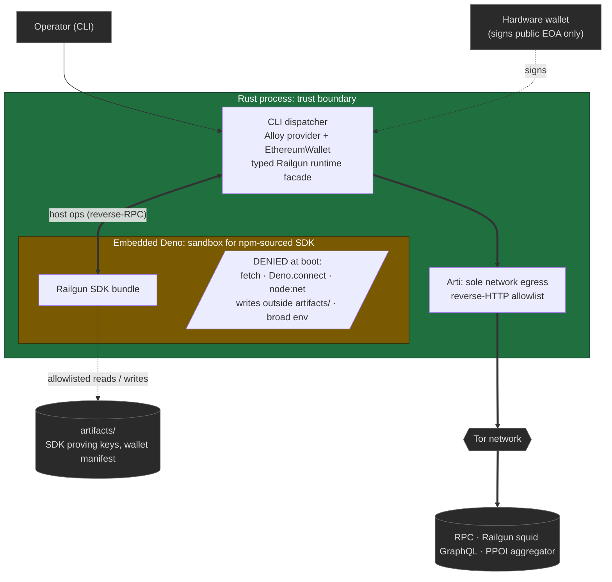

# Hermetic

Hermetic is an exploration ground for access-layer privacy in blockchain interactions.
Every step a user takes to read or write a chain (resolving names, opening RPC sockets, fetching state, signing, submitting) leaks metadata to someone: an ISP, an RPC provider, an indexer, a bundler, the chain itself.
Hermetic treats each of those steps as a slot where a privacy primitive can be swapped in, and tries to make the slots compose.

The first alpha pairs Tor at the network layer with Railgun at the transaction-graph layer, and exercises the stack against Ethereum Sepolia.
The chain, the RPC, the network-privacy component, and the chain-privacy component are all parameters;
Sepolia is just the alpha default.
The rest of this README is what runs today, what's wired loosely enough to swap, and what we want to plug in next.

## Access layers we care about

Legend: ✅ implemented in the alpha, 🚧 partial, ⚠️ explicit gap, 🔭 candidate (research target).

| Layer | What leaks | Why we want to experiment here | Roadmap |
|---|---|---|---|
| Network transport | IP, traffic shape, ISP, on-path observers | Low-latency anonymity (Tor) vs higher-latency, stronger-anonymity mixnets. What's usable when users tolerate seconds, not minutes? | ✅ Tor via Arti, 🔭 Nym mixnet, 🔭 HOPR, 🔭 I2P, 🔭 VPN baseline |
| Name resolution | DNS resolver sees every host you contact | Often forgotten; a trivial bypass of every privacy layer above it | ✅ DNS delegated to Tor (hostnames passed to `TorClient::connect`), 🔭 DoH over mixnet, 🔭 DoT pinned over private transport |
| RPC access | Provider sees every address, balance, block, and log you query | Probably the highest-leverage leak after the chain itself. PIR is real but expensive; self-hosting is operationally heavy. Where's the practical middle? | ✅ Allowlisted reverse-HTTP routed through Tor, 🔭 Oblivious RPC / single-server PIR, 🔭 Self-hosted node behind onion service, 🔭 Batched and decoy queries |
| Light-client sync | Sync filters reveal which addresses and contracts you care about | Light clients rotate the threat from "trust RPC" to "leak interest." Bloom-filter false-positive rate is a privacy parameter, not just a bandwidth one | 🔭 Helios over Tor, 🔭 Portal Network, 🔭 Nimbus, 🔭 Full-node co-located with mixnet |
| Mempool submission | Bundlers, relays, and peers see the pre-confirmation tx and source IP | Front-running and submission-time deanonymization. Encrypted mempools and SUAVE-class designs are nascent and worth measuring | 🚧 Broadcast routed through Tor (no encrypted-mempool integration yet), 🔭 Flashbots Protect over Tor, 🔭 MEV-Share, 🔭 Encrypted mempool (SUAVE), 🔭 Private relays |
| Account linkability | Address reuse correlates activity across dApps and time | Stealth addresses and account abstraction make this addressable; UX is the actual bottleneck | ⚠️ Not addressed in the alpha (operator-managed), 🔭 EIP-5564 stealth addresses, 🔭 Per-dApp HD derivation, 🔭 AA with rotating keys |
| Transaction graph | The chain itself: senders, receivers, amounts, contracts | Different ZK designs trade off liquidity, jurisdictional posture, and audit story. We want concrete comparisons, not vibes | ✅ Railgun shielded pool, 🔭 Aztec, 🔭 Penumbra, 🔭 Namada, 🔭 Privacy Pools, 🔭 Mixers with proof-of-innocence |
| Off-chain indexers | Subgraphs, GraphQL endpoints, oracle feeds learn your queries | Underexplored: chain-graph privacy is undermined the moment your wallet asks a public indexer "did I receive anything?" | ✅ Indexer queries (Railgun quick-sync) routed through Tor, 🔭 Indexer-side PIR, 🔭 Distributed indexers, 🔭 Local indexer over Portal data |

The aspiration is that any roadmap entry can be swapped in without rewriting the layers above or below it.
The current code reaches that for network transport in part (egress is centralized in `src/tor/`);
the chain-privacy slot is tightly coupled to Railgun, and decoupling it is the next round of structural work.

## Current alpha

- **Network privacy.** Tor via Arti.
  Every outbound TCP stream the Rust process opens originates in `src/tor/` and goes through `TorClient::connect`.
  The doctor command verifies that nothing else opens sockets.
- **Chain privacy.** Railgun.
  The SDK is JavaScript, so it runs inside an embedded Deno worker (`src/embedded/`) loaded from a bundle generated under `railgun-runtime/`.
  The worker is denied ambient `fetch`, `Deno.connect`, `node:net`, writes outside `artifacts/`, and broad env reads.
  When the SDK needs JSON-RPC, GraphQL, or PPOI HTTP, it emits a reverse request to Rust, which maps it to an allowlisted service and performs it through Tor.
- **Network parameter.** `--rpc` and `--chain-id` are accepted on every command that needs them.
  The defaults are Sepolia (`https://ethereum-sepolia-rpc.publicnode.com`, chain ID `11155111`);
  the binary itself is not Sepolia-specific.
- **Signer.** Alloy `PrivateKeySigner` or a hardware-wallet signer, wrapped into `EthereumWallet`.
  The hardware wallet only protects the public gas-payer EOA;
  the Railgun mnemonic is still loaded by the SDK runtime.

## Quickstart

The fastest path is the published Docker image, which bakes in the binary, the embedded Railgun bundle, and the SDK's WASM addons.
A from-source path for contributors follows below.

### Run via Docker

The multi-arch image lives at `ghcr.io/raulk/hermetic:latest` (built for `linux/amd64` and `linux/arm64`).

**1. Set up a working directory and secrets.**

```sh
mkdir hermetic && cd hermetic
curl -L -O https://raw.githubusercontent.com/raulk/hermetic/main/.env.example
mv .env.example .env
printf "HERMETIC_RAILGUN_ENCRYPTION_KEY=%s\n" "$(openssl rand -hex 32)" >> .env
```

The encryption key is a local symmetric key for the SDK's wallet store, not a chain secret.

**2. Define a `hermetic` alias.**

```sh
alias hermetic='docker run --rm -it \
  -v "$(pwd)/artifacts":/app/artifacts \
  -v "$(pwd)/.arti":/app/.arti \
  --env-file .env \
  ghcr.io/raulk/hermetic:latest'
```

The two volume mounts persist SDK proving keys plus wallet manifest (`artifacts/`) and the Tor consensus and circuit cache (`.arti/`) across runs.
Without them every invocation re-downloads SDK artifacts and rebuilds the Tor circuit.

**3. Verify Tor egress.**

```sh
hermetic ping --rpc https://ethereum-sepolia-rpc.publicnode.com
```

The first invocation waits for Arti to build a Tor circuit.

**4. Create a Railgun wallet.**

```sh
hermetic wallet create --label main
```

The mnemonic is printed once.
Save it outside the working directory;
the manifest only stores the SDK wallet ID, the shielded address, and the label.

**5. Refresh the private balance over Tor.**

```sh
hermetic balance --wallet main
```

This is the end-to-end check that does not require Sepolia ETH.
The SDK reaches the Railgun squid GraphQL endpoint and the PPOI aggregator through the reverse-RPC bridge and Tor, syncs shielded notes for the fresh wallet, and reports a zero balance.
If it returns without errors, every layer in the architecture diagram just got exercised.

**6. (Optional, requires a funded Sepolia EOA) Shield and unshield 1 wei round-trip.**

Add the gas-payer private key:

```sh
printf "HERMETIC_PRIVATE_KEY=0x...\n" >> .env
```

Shield, wait for the squid to index it, then unshield back:

```sh
hermetic shield --amount-wei 1 --wallet main
# wait seconds to a couple of minutes for the squid to index the shield
hermetic balance --wallet main          # shielded balance reports 1 wei
hermetic unshield --amount-wei 1 --wallet main
hermetic balance --wallet main          # shielded balance returns to 0
```

The full sequence (shield → squid index → balance → unshield proof → squid index → balance) exercises every layer of the access stack against a live testnet.
Pass `--ledger` instead of setting `HERMETIC_PRIVATE_KEY` to sign with a hardware wallet.
The `Commands` section below documents `--dry-run` if you want to populate without broadcasting.

### Run from source

For contributors who want to build the binary locally.

**1. Prerequisites.**
Rust 1.91+, Node and npm, `just`, and `openssl`.

**2. Install.**

```sh
git clone https://github.com/raulk/hermetic && cd hermetic
just install
```

`just install` runs `npm ci`, builds the embedded Railgun bundle, and `cargo install --path .`.
The compiled binary lands at `~/.cargo/bin/hermetic`.

**3. Run from the repo root.**

The binary resolves `embedded/railgun_runtime.bundle.mjs` and the SDK's WASM addons from paths under the working directory, so all commands must be invoked from inside the cloned repo.
From there, configure `.env` and follow steps 3 through 6 of the Docker path with `hermetic` in place of the aliased docker invocation.

## Architecture



The embedded worker loads `embedded/railgun_runtime.bundle.mjs`, generated from the modules under `railgun-runtime/src/`.
JavaScript cannot open sockets or use ambient network fetch.
When the Railgun SDK makes a network call, control crosses back into Rust through the host op surface in `src/embedded/`, which dispatches to the reverse-HTTP allowlist in `src/tor/`.
Today that allowlist contains the Railgun Sepolia squid GraphQL endpoint and the PPOI aggregator;
additions to it are part of the trusted bundled-runtime boundary, not configuration.

## Railgun integration: embedded Deno

The Railgun SDK ships only as JavaScript (`@railgun-community/wallet` on npm), so using it from Rust means hosting a JavaScript runtime in-process.
Hermetic embeds Deno via `deno_core` and `deno_runtime` (with `node_resolver` and the `deno_node` Node-compat layer) rather than spawning a Node or Bun sidecar, or handing the SDK a custom native FFI surface.

The privacy invariant decided the shape.
The Rust process owns every TCP socket the system opens, and the embedded runtime must not be able to circumvent that.
Deno's permission model maps cleanly onto the deny list we want: no ambient `fetch`, no `Deno.connect`, no `node:net`, no writes outside `artifacts/`, no broad env reads.
All five are denied at worker construction in `src/embedded/`;
the doctor command exercises each denial.
A separate Node process would have its own network namespace and a wider review surface than a single Deno worker we configure inside the same address space.

Native FFI was the other obvious option, and we rejected it.
Arti, the Rust Tor library, does not ship official Node, Deno, or Bun bindings.
A custom shim is feasible, but every shim is a fresh ABI surface that has to be reviewed for whether it can be coerced into opening a raw socket or leaking environment.
Embedding the JS runtime inside the same process as Arti gives us one network owner (Rust), one allowlist (`src/tor/`), and no FFI in between.

The bridge between the SDK and the Tor transport is reverse-RPC.
When the SDK needs JSON-RPC, GraphQL, or PPOI HTTP, it calls a host op exposed by `src/embedded/`, which marshals the request back into Rust.
Rust matches the request against an allowlist (the operator's RPC for JSON-RPC, the Railgun squid GraphQL endpoint for quick-sync, the PPOI aggregator for proof-of-innocence) and performs it through the Tor-backed Hyper connector in `src/tor/`.
The SDK sees a normal async response;
it never learned the network exists.

The runtime is built as an ESM bundle.
`railgun-runtime/src/` contains the Hermetic-side modules (`runtime.mjs` entry, `network.mjs`, `storage.mjs`, `snark.mjs`, `permissions.mjs`, `artifacts.mjs`, `host-ops.mjs`) that wire the SDK into the host op surface;
`railgun-runtime/build-embedded.mjs` bundles them with the SDK into `embedded/railgun_runtime.bundle.mjs`, which is what the embedded Deno worker loads.
Generated bundle files are not committed;
`just bundle` regenerates them.

The cost is real.
Embedded Deno pulls a V8 isolate, a non-trivial chunk of the Deno runtime, and enough of the Node-compat layer to satisfy the SDK's transitive dependencies, and cold start is dominated by V8 and module evaluation.
We accepted that as the price of a single-process privacy invariant.
If the chain-privacy slot ever exposes a Rust-native shielded-pool component (Aztec, Penumbra, a Rust port of Railgun core), the Deno worker disappears with it.

## Requirements

- Rust 1.91+
- Node/npm for bundling the Railgun runtime
- `just` for the documented recipes

Install JS dependencies:

```sh
cd railgun-runtime
npm install
```

Generate the embedded Railgun bundle:

```sh
just bundle
```

The generated `embedded/` files are build outputs and are intentionally not committed.

## Checks

```sh
just doctor
just check
```

The doctor command verifies that the Railgun SDK loads under embedded Deno,
and that Deno `fetch`, `Deno.connect`, `node:net`, writes outside artifacts, and broad env reads are denied while artifact reads are allowed.

## Environment

Secrets can come from the shell or from a `.env` file in the working directory (see `.env.example`).
Shell variables override file values.
The recognized variables are:

- `HERMETIC_RAILGUN_ENCRYPTION_KEY`: operator-supplied SDK wallet key.
- `HERMETIC_RAILGUN_MNEMONIC`: Railgun mnemonic for `wallet import`.
- `HERMETIC_PRIVATE_KEY`: hex private key for the public gas-payer EOA.

`.env` is gitignored.

## Commands

Check the public signer address:

```sh
cargo run -- signer-address --private-key "$HERMETIC_PRIVATE_KEY"
cargo run -- signer-address --ledger
```

Hardware-wallet options are available anywhere a public signer is required:

- `--ledger`: connect to the hardware wallet's Ethereum app.
- `--ledger-index <n>`: account index; default is `0`.
- `--ledger-path <path>`: use a custom derivation path.
- `--chain-id <id>`: signer chain ID; default is Sepolia `11155111`.

The hardware wallet only protects the public EOA used to pay gas and broadcast transactions.
The Railgun wallet mnemonic is still loaded by the SDK runtime.

Ping an RPC endpoint through Tor:

```sh
cargo run -- ping --rpc https://ethereum-sepolia-rpc.publicnode.com
```

Import an existing Railgun mnemonic into the SDK artifact store:

```sh
cargo run -- wallet import \
  --label main \
  --railgun-mnemonic "$HERMETIC_RAILGUN_MNEMONIC" \
  --encryption-key "$HERMETIC_RAILGUN_ENCRYPTION_KEY"
```

Create a new Railgun wallet:

```sh
cargo run -- wallet create \
  --label main \
  --encryption-key "$HERMETIC_RAILGUN_ENCRYPTION_KEY"
```

The create command prints the mnemonic once.
Store it outside this repository;
the manifest stores only the SDK wallet ID, shielded address, and label.

List known wallets:

```sh
cargo run -- wallet list
```

Populate a base-token shield transaction without broadcasting:

```sh
cargo run -- shield \
  --dry-run \
  --amount-wei 1 \
  --ledger \
  --wallet main \
  --encryption-key "$HERMETIC_RAILGUN_ENCRYPTION_KEY"
```

Refresh private balance through Tor:

```sh
cargo run -- balance \
  --wallet main \
  --encryption-key "$HERMETIC_RAILGUN_ENCRYPTION_KEY"
```

Populate an unshield transaction without broadcasting:

```sh
cargo run -- unshield \
  --dry-run \
  --amount-wei 1 \
  --ledger \
  --wallet main \
  --encryption-key "$HERMETIC_RAILGUN_ENCRYPTION_KEY"
```

## Repository map

- `src/main.rs`, `src/lib.rs`: binary entry and crate surface.
- `src/cli/`: clap argument structs (`args.rs`), dispatcher (`run.rs`), and per-command bodies (`actions/`).
- `src/tor/`: Arti bootstrap, hyper connector, JSON-RPC transport, and the reverse-HTTP service allowlist.
  Every outbound TCP stream the process opens originates here.
- `src/eth/`: Alloy provider construction, public-signer args, transaction parsing/broadcast, and Sepolia network defaults.
- `src/railgun/`: typed Railgun runtime facade (`mod.rs`, typestate), wallet manifest, file-backed artifact store, and the Tor-backed reverse-RPC servicer.
- `src/embedded/`: embedded Deno worker, host op surface, Node compat plumbing, and the JS bootstrap shim.
- `railgun-runtime/src/`: bundled Railgun SDK runtime, split into `runtime.mjs` (entry/dispatch), `network.mjs`, `storage.mjs`, `snark.mjs`, `permissions.mjs`, `artifacts.mjs`, `host-ops.mjs`.
- `railgun-runtime/build-embedded.mjs`: bundle generation for embedded Deno.
- `spec.md`: fuller design notes and historical plan.
- `AGENTS.md`: implementation guidance and verification notes.
- `docs/wayfinding/`: exploratory artifacts retained for design history.

## Boundaries and non-goals

Hermetic is a research workbench, not a wallet and not audited.

- It is not an audited wallet.
  The signing surface uses Alloy types directly;
  the embedded SDK runs unaudited bundled JavaScript.
  Do not move funds through it that you are not willing to lose.
- It does not anonymize on-chain signatures or transaction payloads beyond what the active chain-privacy component provides.
  If the chain-privacy slot is empty, the chain still sees what it always sees.
- Tor provides low-latency onion routing, not mixnet-grade traffic-analysis resistance.
  A global passive adversary correlating timing across entry and exit can deanonymize Tor flows;
  that is a known limitation of the layer, and a reason mixnets are on the roadmap.
- The reverse-HTTP allowlist (Railgun Sepolia squid GraphQL, PPOI aggregator) is part of the trusted bundled-runtime boundary.
  Adding to it is a privacy decision, not a configuration tweak.
- Account linkability is operator-managed.
  The alpha does nothing to prevent address reuse across dApps;
  that is a gap the roadmap addresses, not a property the current code provides.
